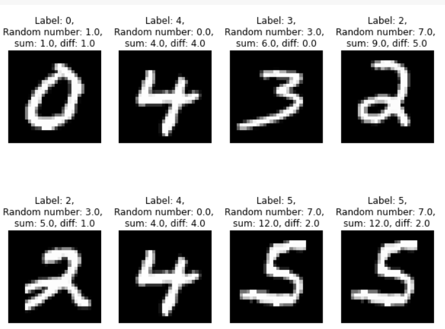
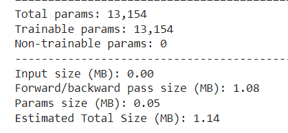
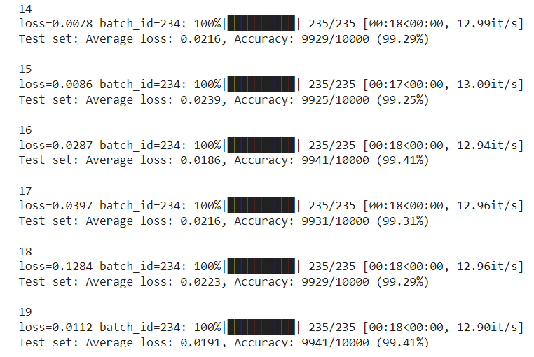

# Training MNIST Dataset with less than 15k PARAMETERS


Our target is to achieve:

- 99.4% (this must be consistently shown in your last few epochs, and not a - one-time achievement)
- Less than or equal to 20 Epochs
- Less than 15000 Parameters


## Aproach to the problem 

- Importing required Libraries
- Downloading the dataset
- Data Visualisation
- Defining the Network
- Training the Network
- evaluating the model
- plotting the loss curve and the accuracy against the epochs 

  
# Data Visualisation


## Defining the network
```python

class Net(nn.Module):
  def __init__(self):
    super(Net, self).__init__()

    self.max_pool = nn.MaxPool2d(2,2)
    drop = 0.05

    self.conv_block1 = nn.Sequential(
        nn.Conv2d(1, 8, 3, padding=1, bias=False),
        nn.BatchNorm2d(8),
        nn.ReLU(),
        nn.Dropout2d(drop),

        nn.Conv2d(8, 24, 3, padding=1, bias=False),
        nn.BatchNorm2d(24),
        nn.ReLU(),
        nn.Dropout2d(drop),

        #nn.Conv2d(16, 24, 3, padding=1, bias=False),
        #nn.BatchNorm2d(24),
        #nn.ReLU(),
        #nn.Dropout2d(drop),
    )

    self.transition1 = nn.Sequential(
        nn.Conv2d(24, 8, 1, bias=False),
        nn.BatchNorm2d(8),
        nn.ReLU(),
        nn.Dropout2d(drop),
    )

    self.conv_block2 = nn.Sequential(
        nn.Conv2d(8, 16, 3, bias=False),
        nn.BatchNorm2d(16),
        nn.ReLU(),
        nn.Dropout2d(drop),

        nn.Conv2d(16, 24, 3, bias=False),
        nn.BatchNorm2d(24),
        nn.ReLU(),
        nn.Dropout2d(drop),
    )

    self.transition2 = nn.Sequential(
        nn.Conv2d(24, 8, 1, bias=False),
        nn.BatchNorm2d(8),
        nn.ReLU(),
        nn.Dropout2d(drop),
    )
  
    self.conv_block3 = nn.Sequential(
        nn.Conv2d(8, 16, 3, bias=False),
        nn.BatchNorm2d(16),
        nn.ReLU(),
        nn.Dropout2d(drop),

        nn.Conv2d(16, 32, 3, bias=False),
        nn.BatchNorm2d(32),
        nn.ReLU(),
        nn.Dropout2d(drop),
    )

    self.gap = nn.Sequential(
        nn.AvgPool2d(6)
    )
    self.dense = nn.Linear(32, 10)

  def forward(self, x):
    x = self.conv_block1(x)
    x = self.max_pool(x)
    x = self.transition1(x)

    x = self.conv_block2(x)
    x = self.transition2(x)

    x = self.conv_block3(x)
    # x = self.transition3(x)

    x = self.gap(x)
    x = x.view(-1, 32)    
    x = self.dense(x)

    return F.log_softmax(x, dim=1)

  ```
  Here we defined a network with 3 convolution blocks and a transition layer between each convolution block. we used regularisation tehniques like batch normalisation,and dropout to optimize the output .
  ## checking the parameters through summary
  
  There are totally 13154 parameters in the network 

  ## Evaluating the Model
  
  
  For each epoch we calculated the loss and accuracy and  we reached our target of accuracy 99.4%
  ## Plotting the Loss curve and the accuracy curve varying for different epochs
  
